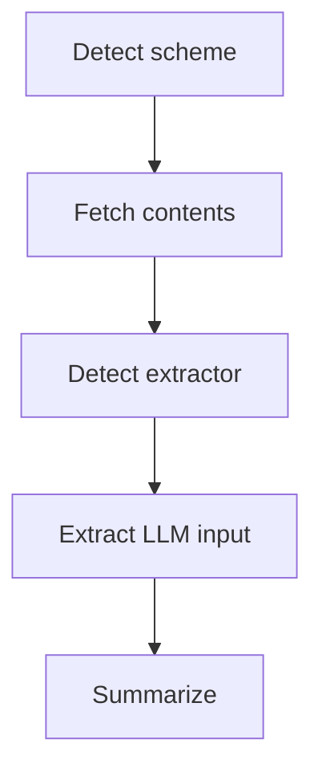

# nosy

[](https://github.com/ynqa/nosy/actions/workflows/ci.yml)

*nosy* is a CLI tool that fetches content from URLs or local files, extracts text using appropriate extractors,
and summarizes it using LLMs. It supports multiple formats including HTML, PDF, Office documents, audio/video, and more.

## Features

- Input from URL or local file
  - Supports HTTP GET and headless browser for URLs
- Select executior automatically based on MIME type and file extension, or specify manually
- Supports various extractors:
  - [x] Plain Text
  - [x] HTML
  - [x] PDF
  - [x] Pandoc (docx, doc, odt, rtf, epub, latex, etc.)
  - [x] Whisper (mp3, wav, mp4, m4a, etc.)
    - means transcribe audio to text
- Supports major LLM providers (OpenAI, Anthropic, Gemini, etc.)
- Customize output tone via templates
- Tab-complete support for bash, zsh, fish, and so on.

## Installation

### shell

```bash
curl --proto '=https' --tlsv1.2 -LsSf https://github.com/ynqa/nosy/releases/download/v0.1.0/nosy-installer.sh | sh
```

### Homebrew

```bash
brew install ynqa/tap/nosy
```

### Cargo

```bash
cargo install nosy

# Or from source (at the repository root)
cargo install --path .
```

## Usage

> [!NOTE]
> Running `nosy` alone is equivalent to `nosy summarize`.

```bash
nosy <INPUT> -o <OUTPUT> [OPTIONS]
```

### Examples

```bash
# Summarize a web article
nosy https://example.com/article -o summary.md

# Summarize a local PDF file
nosy ./docs/report.pdf -o summary.md

# Summarize a local PDF file in Japanese
nosy ./docs/report.pdf -o summary.md --lang Japanese

# Summarize using a specific LLM model (provider will be inferred)
nosy https://example.com/article -o summary.md --model gpt-4o
```

## Auxiliaries

This CLI's main use case is summarization via `nosy (summarize)`,
but it also provides several auxiliary subcommands to support that.

### extract

Extract text suitable for LLM input based on the input information.

```bash
nosy extract <INPUT> -o <OUTPUT> [OPTIONS]
```

### completion

Generate shell completion scripts.

```bash
nosy completion zsh
```

### download-whisper

This subcommand downloads
[Whisper Models](https://huggingface.co/ggerganov/whisper.cpp)
used for text extraction from audio/video files.

```bash
nosy download-whisper base -o ./models
```

After downloading, set `WHISPER_MODEL_PATH` to use it for extraction.

## Options

```bash
various contents summarization tool powered by artificial intelligence

Usage: nosy [OPTIONS] [INPUT] [COMMAND]

Commands:
  extract           Extract fetched content to text for LLM consumption (alias: ext)
  summarize         Summarize content using LLM (alias: recap)
  completion        Generate shell completion script for specified shell (alias: comp)
  download-whisper  Download Whisper model to a specified path
  help              Print this message or the help of the given subcommand(s)

Arguments:
  [INPUT]  Input path or URL

Options:
  -o, --out <OUTPUT>               Output file path
  -w, --workdir <WORKDIR>          Working directory for temporary files
      --log-level <LOG_LEVEL>      Set log level [default: info] [possible values: off, error, warn, info, debug, trace]
      --no-progress                Disable progress bar
      --http-fetch-mode <MODE>     HTTP fetch mode (only if input scheme is HTTP or HTTPS) [default: get] [possible values: headless, get]
      --ext-kind <EXTRACTOR_KIND>  Force extractor kind for extraction [possible values: plain, html, pdf, pandoc, whisper]
      --provider <PROVIDER>        LLM service provider [possible values: github-copilot, open-ai, open-ai-resp, gemini, anthropic, fireworks, together, groq, mimo, nebius, xai, deep-seek, zai, big-model, cohere, ollama]
      --model <MODEL>              LLM model identifier (e.g., claude-sonnet-4-5-20250929) [default: claude-sonnet-4-5-20250929]
      --system-template <PATH>     Path to the system message template file (defaults to built-in template)
      --user-template <PATH>       Path to the user message template file (defaults to built-in template)
      --lang <LANGUAGE>            Language for the summary [default: English]
  -h, --help                       Print help (see more with '--help')
  -V, --version                    Print version
```

## Environment Variables

### LLM API Keys

If `--provider` is specified, the default key for that provider is used.
If omitted, the default key for the inferred provider from the model name is used.

LLM provider API keys are obtained from the following environment variables:

- e.g. `OPENAI_API_KEY`, `ANTHROPIC_API_KEY`, `XXXX_API_KEY` (for other supported providers, see the full list in the help output)

### Path to Whisper Model

`WHISPER_MODEL_PATH` is used to specify the path to the Whisper model file for audio/video text extraction.

## Templates

Templates are written in [Handlebars](https://handlebarsjs.com/).
The default templates are located in [assets/](./assets/).

The following variables are available in each template:

- System template
  - `{{language}}`: Language for the summary
- User template
  - `{{content}}`: Extracted content to be summarized

## Flowchart to Summarization



1. Detect scheme from input (URL or local file)
2. Fetch contents based on the scheme
3. Detect extractor based on MIME type and file extension (or use forced extractor if specified)
4. Extract LLM input using the selected extractor
5. Summarize using the specified LLM model and templates

## Capabilities

This section describes

- what input formats are supported
- how text is extracted from data
- what LLM providers are available

in *nosy*

### Inputs

- HTTP/HTTPS URLs
- Local files (`/` or `file://`)

### Extractors (auto-detected)

- Plain Text
  - (Pass-through input as-is)
- HTML (built-in)
- PDF (built-in)
- Pandoc (for docx, doc, odt, rtf, epub, latex, ...)
  - Require [pandoc](https://pandoc.org/) command installed
- Whisper (for mp3, wav, mp4, m4a, ...)
  - Require Whisper model file specified by `WHISPER_MODEL_PATH`

### LLM providers

See the help output for the full list of supported LLM providers (i.e., `nosy summarize --help`).
